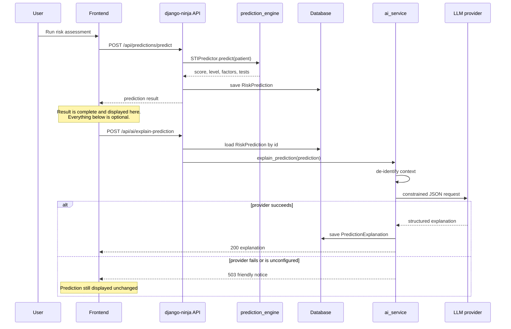

# Architecture

## System overview

The platform has two independent intelligence layers. The machine learning
engine produces the prediction and is the sole source of truth for risk. The
LLM layer only explains what the ML engine already decided.

```
                            ┌──────────────┐
                            │     User     │
                            └──────┬───────┘
                                   │
                          ┌────────▼─────────┐
                          │     Frontend     │
                          │  React + Vite    │
                          └────────┬─────────┘
                                   │  HTTP /api
                          ┌────────▼─────────┐
                          │   Backend API    │
                          │   django-ninja   │
                          └───┬──────────┬───┘
                              │          │
        ┌─────────────────────┘          └──────────────────────┐
        │                                                       │
┌───────▼────────────────────┐               ┌──────────────────▼───────────┐
│   ML Prediction Engine     │               │   LLM Explanation Service    │
│   prediction_engine/       │               │   ai_service/                │
│                            │               │                              │
│  • feature preprocessing   │               │  • de-identify context       │
│  • RandomForest predict    │               │  • build prompts             │
│  • risk scoring / banding  │               │  • call provider             │
│  • SHAP explainability     │               │  • validate + persist        │
│  • recommendations         │               │                              │
└───────┬────────────────────┘               └──────────────┬───────────────┘
        │                                                   │
┌───────▼────────────────────┐               ┌──────────────▼───────────────┐
│    Prediction Result       │──────────────▶│   Structured Explanation     │
│   (RiskPrediction row)     │   read only   │  (PredictionExplanation row) │
│                            │               │                              │
│  risk_score, risk_level,   │               │  summary, what_this_means,   │
│  top_risk_factors,         │               │  important_considerations,   │
│  likely_stis, tests        │               │  recommended_next_steps      │
└────────────────────────────┘               └──────────────────────────────┘
```

The arrow between the two result boxes points one way only. `ai_service`
imports from `prediction_engine`; `prediction_engine` never imports
`ai_service`. A test (`MLIndependenceTests.test_prediction_engine_does_not_import_ai_service`)
enforces this by scanning the engine's source.

## Request sequence



## Why the layers are separate

| Concern | Why separation matters |
|---|---|
| **Correctness** | The ML model is trained, versioned and evaluated against labelled data. Its output is reproducible. An LLM's is not. Only the reproducible component is allowed to determine risk. |
| **Safety** | An LLM that could adjust a score could adjust it wrongly, with no audit trail and no metric that would catch it. The explanation layer has no write access to any prediction field. |
| **Availability** | Provider outages, rate limits, expired keys and network failures are routine. None of them can affect screening, because prediction never awaits the LLM. |
| **Cost** | Prediction is free after training. LLM calls are billed per request. Coupling them would put a per-token price on every screening. |
| **Auditability** | `RiskPrediction` records what the model decided; `PredictionExplanation` records what the AI said about it. Separate rows, separately reviewable. |

## Safety controls in the AI layer

Four independent mechanisms, so no single failure removes the guarantee:

1. **Prompt** — `ai_service/prompts.py` states all ten safety rules explicitly.
2. **Schema** — `EXPLANATION_JSON_SCHEMA` has no field for a score,
   probability, risk level or diagnosis, and sets `additionalProperties:
   false`. The model has no channel through which to override the prediction,
   even if it ignores the prompt.
3. **Server-owned disclaimer** — `DISCLAIMER_TEXT` is written over whatever the
   model returns, so the disclaimer cannot drift or be argued away.
4. **De-identification** — `context_builder.py` sends an age *band* and the
   model's own outputs. Name, patient ID, date of birth, phone, email, address
   and county never leave the system.

## Phase 2: planned RAG pipeline

Not implemented. The seam exists at `ai_service/retrieval.py`, which is called
on every request and currently returns an empty list.

```
Trusted documents (WHO / MoH / CDC guidance)
        ↓
Document processing
        ↓
Chunking
        ↓
Embeddings
        ↓
Vector database (Chroma or FAISS)
        ↓
Relevant context retrieval        ← ai_service/retrieval.py
        ↓
LLM
        ↓
Grounded educational response
```

Adding it means writing one retriever class and pointing `get_retriever()` at
it. The service, prompts, schemas, API and frontend do not change — the
`context_documents` block is already rendered into the prompt and already
covered by a test.
